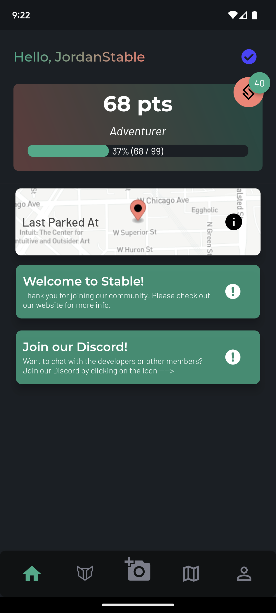
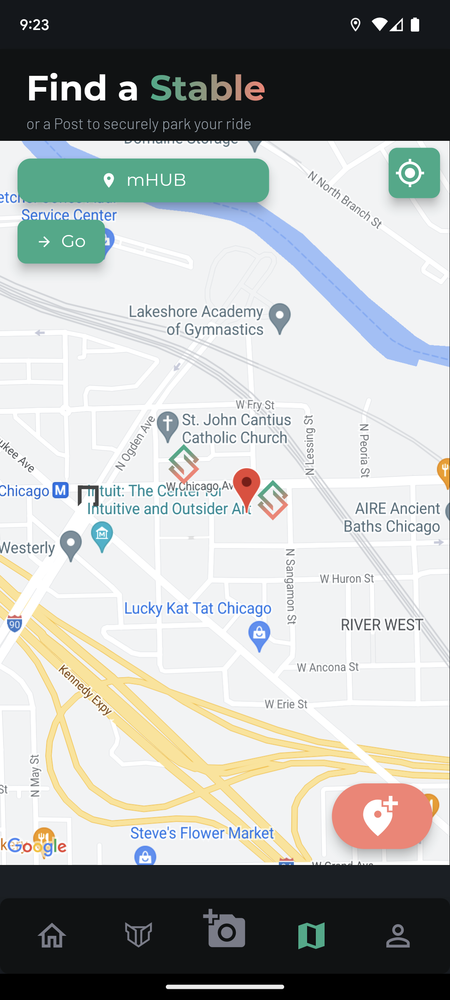
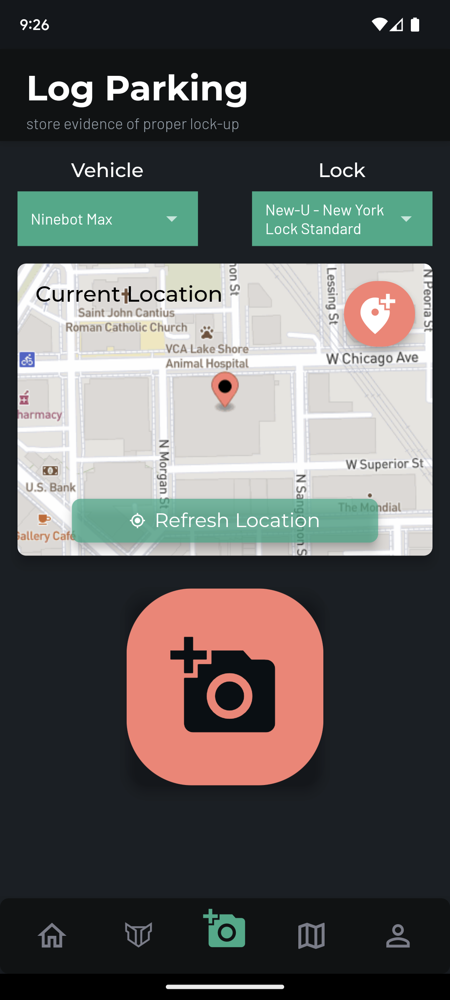

# Introduction

The Stable App is a mobile app for iOS and Android that helps micromobility vehicle owners **find secure parking**, **streamline the process of gathering evidence** to make theft insurance claims, and [**get theft protection**](stablecare/what-is-stablecare.md) for their e-scooter, e-bike, or other personal electric vehicle (PEV).

 

||| Home Page

||| Find a Stable

||| Log Parking

|||

## Who is it for?

The Stable App is intended for all people who own their own micromobility vehicle—such as a bicycle, e-bike, or e-scooter—and have to park it outside from time to time.

The core features of the app are specifically geared toward riders who have theft insurance (such as [Velosurance](https://velosurance.com), [Simple Bike Insurance](https://simplebikeinsurance.com), or [Markel](https://www.markelinsurance.com/bicycle)) or some other kind of theft reimbursement policy, such as [Kryptonite's Anti-Theft Protection Offer (ATPO)](https://shop.kryptonitelock.com/atpo\_landing\_pages/register-for-anti-theft-en.html?origin=en.html).

Even if you don't have theft coverage, we encourage all riders to use the app. As more people use it, we'll learn more about where thefts occur, which vehicles are most targeted, and which locks are most easily defeated—and are committed to sharing this info with you to help reduce the chances that you fall victim to theft.

## Finding and Mapping Parking Spots

The Stable App allows users to **find** and **map** parking spots for bicycles, personal electric vehicles (PEVs), and other micromobility vehicles.

### Adding Unmapped Parking Spots

If a user finds a parking spot—such as a bike rack or other immovable object—they can choose to add that parking spot to the map by [Mapping a Stable](overview/mapping-stables.md). Over time, this community-driven effort will build out a map of parking spots to help other riders in their neighborhood or city find parking that meets their needs.

### Finding Mapped Parking Spots

Users can also look for parking spots that others have previously mapped on the map view. If you are planning your route, you can enter your destination into the place picker and hit "Go" to see if there are any mapped parking spots nearby.

### Posts and Stables

Parking spots can be considered either [Posts](definitions/post.md) or [Stables](definitions/stable.md). A **Stable** is a parking spot that is within view of a security camera. Conversely, a **Post** (short for "Hitching Post") is a parking spot that is **not** within view of a security camera.

!!! About camera-monitored spots
We are aware that, just because there is a security camera nearby, doesn't necessarily mean that it's operational, pointed at the parking spot, and that the owner is willing to share the footage. We are actively developing the process of verifying these details.
!!!

The reason we differentiate camera-monitored spots is simple: if your vehicle gets stolen, you ideally want to get video footage of the theft occurring—**especially if you have theft insurance** or another theft reimbursement coverage.

Video footage is the best proof you can get that you properly locked up your vehicle to an immovable object, and that the lock itself was defeated (picked/cut/etc.) by a thief—which are the most common requirements to filing a theft insurance or reimbursement claim.

## Gathering Evidence

In addition to helping riders find camera-monitored parking spots (Stables), the app also provides a painless way to [Log Parking](overview/logging-parking.md), which can be useful to prove that your vehicle was properly locked up prior to a theft occurring.

To log parking, the rider can open the Log Parking page and quickly snap a photo of your locked-up vehicle before walking away from it. The app securely stores a record of the parking, including:

- the photo of your locked-up vehicle
- its location
- the current date and time
- info about the registered vehicle, including a photo of the vehicle and its serial number (if you chose to register them)
- the registered lock

In the event of a theft, you can easily obtain this information by having the parking record emailed to yourself, or by emailing us at records@stablemobility.io

### Why should I log parking?

If your vehicle gets stolen and you need to file a claim with insurance (or a company offering you a form of theft protection/reimbursement), we can provide you with a verified copy of the parking record. Think of it like DocuSign, but for parking records!

Using the app, you can easily log parking—without flooding your phone's photos album with pictures of your vehicle.

