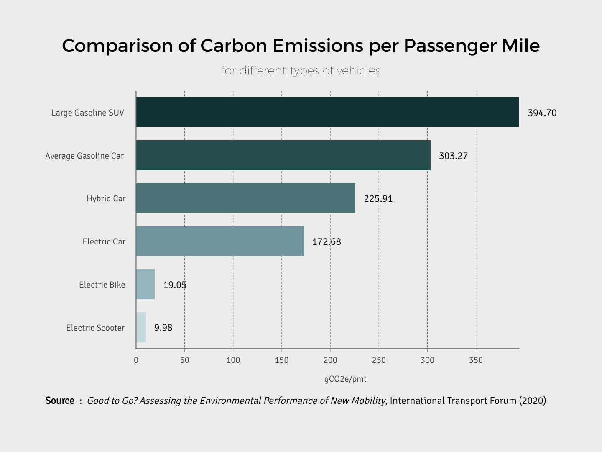

# Our Mission

Stable Micromobility's mission is to build technology that encourages riders to replace car trips with micromobility trips.

## Why replacing car trips matters

Cars are a fantastic mode of transportation _**when you need them**_. This includes going on long journeys, trekking through inclement weather, and hauling lots of cargo or your kids.

But for the majority of trips we take (especially in cities) a car is more often than not provides needless capacity. For internal combustion engine (ICE) cars, we burn excess fossil fuels to move a 4,000 lb car usually carrying only 1 person who weighs less than 5% the weight of their car.

And while EVs effectively emit less carbon than ICE cars, much of the energy from the grid used to charge them is derived from burning fossil fuels. Moreover, EVs inherit the same issue of their ICE counterparts—they are needlessly large and heavy, and thus consume power far in excess of what is needed to move their passenger.

Micromobility offers many benefits over automobility:

- **Faster trips**: The average driving speed in most cities is under 15 mph. Most PEVs average more than this.
- **Reduced congestion**: getting cars off the road reduces traffic (obviously!)
- **Less energy consumed**: most PEVs fit the size of the rider and weigh well under 100 lbs.
- **Cleaner air**: no tailpipe emissions!
- **Lower CO2 emissions**: reduces the single biggest contributor to CO2 emissions: transportation
- **Environmental immersion**: You experience the surrounding environment in a more connected way than in a car.
- **More fun**: Riding through a city is just more fun on a micromobility vehicle!

