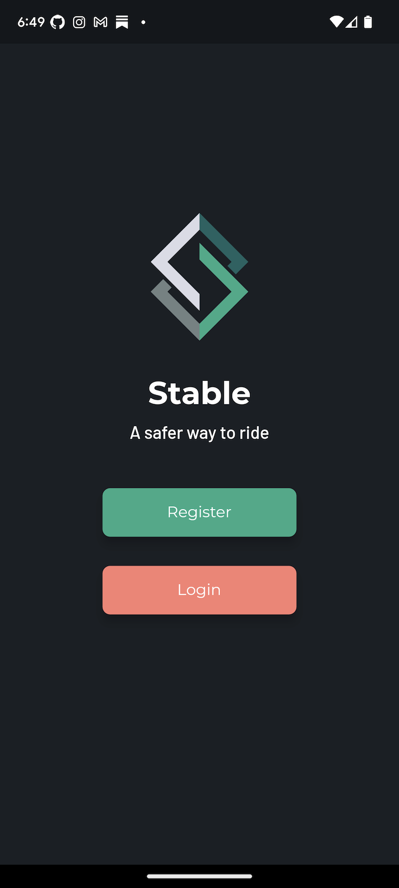
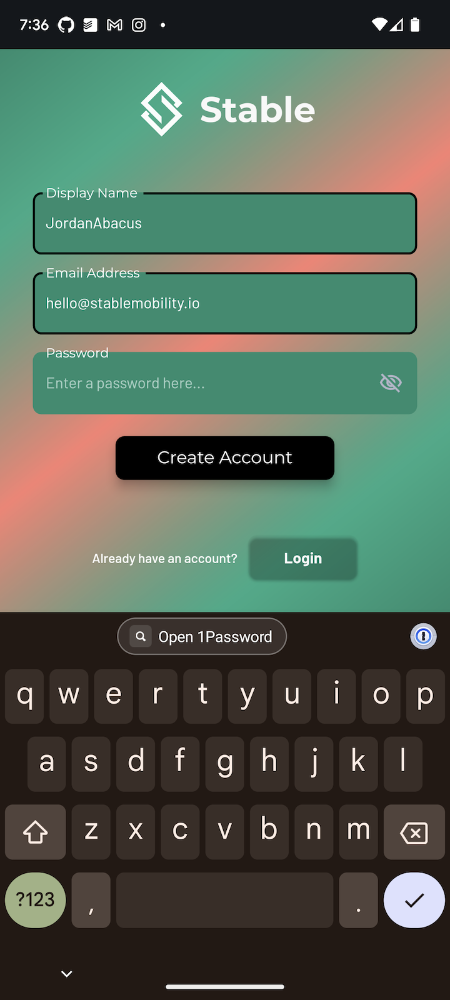
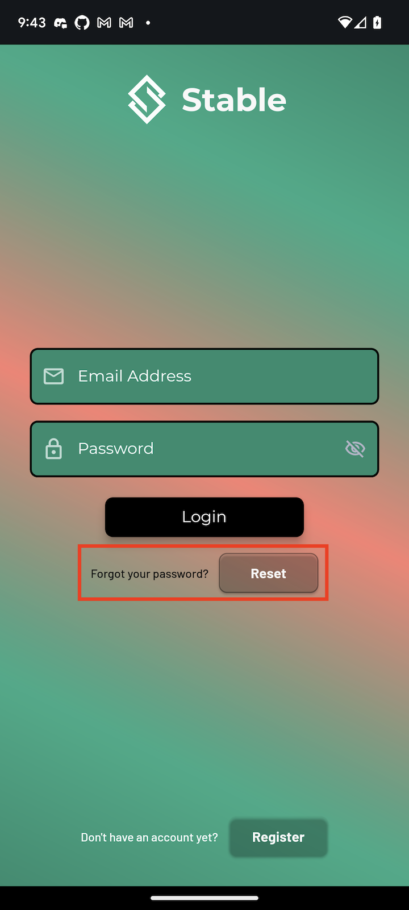

# Account Registration

To create your account, first download the Stable App for iOS (open beta on [TestFlight](https://testflight.apple.com/join/QAQbQUpP)) or Android (open beta on [Google Play Store](https://play.google.com/store/apps/details?id=com.stablemobility.stableapp)).

You should now see the splash screen.

Click on the **Register** button to create a new account. Then, enter in a display name, your email, choose a password, and press "Create Account".

!!! What is a display name?
Your display name is sort of like a username. You can hide your display name from others within the app under the Privacy Settings in the Edit Account page. See [Account Setup](account-setup.md) for more details.
!!!

## Email Verification

When you register a new account, you will automatically be sent an email requesting that you verify your email address. We strongly recommend that you do so, so that if you forget your password, you are able to recover your account using the "Forgot your password" feature on the Login page.

## Resetting Your Password

If you forget your password and need to reset it, click the Reset button on the login page next to "Forgot your password".

