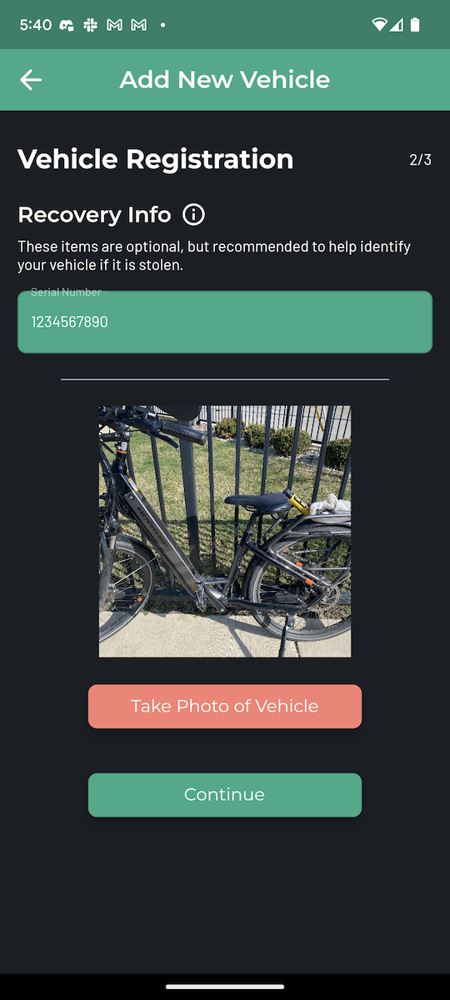
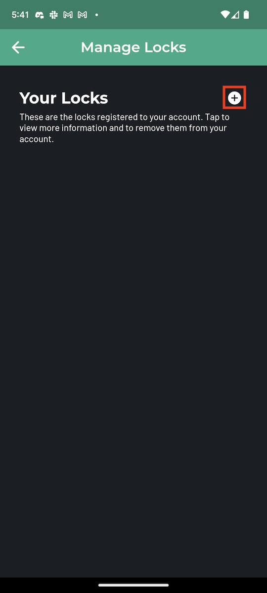

# Account Setup

After signing up, there are a few more steps to finish setting up your new account.

## Vehicle and Lock Registration

Before you are permitted to [Log Parking](logging-parking.md), you must register a vehicle and a lock. This step is important for a few key reasons.

First, if your vehicle happens to get stolen, you'll have a stored record of the vehicle information, including the vehicle's serial number and a photo of the vehicle (if you choose to provide it when registering a new vehicle). This can improve your chances at recovering the vehicle, and make it easier to notify people in your area or online community about the theft.

Second, if your vehicle happens to get stolen and you report that theft in the app, your report will help the community better understand:

- which locks are most vulnerable to theft
- which vehicles tend to be targets of theft
- what time of day thefts are most often to occur
- which areas are theft hotspots in your city

We are committed to sharing this information with the community (provided it is sufficiently anonymous and doesn't jeopardize our users' privacy) to help micromobility riders make smarter decisions about where to not park, when not to leave your vehicle unattended, which locks to avoid, and which vehicles are popular among thieves. However, we will only be able to do this if you add a vehicle and lock to your account.

### Registering your vehicle

To register your vehicle, begin by navigating to the  account settings page. From there, click on "Manage Vehicles".

Click on the + sign at the top right of the page to register a new vehicle to your account.

From there, select your vehicle type, and enter in the make and model of the vehicle.

!!!
The form allows you to enter any vehicle make and model, but will offer autocomplete option for popular vehicle makes and models. Please check the autocomplete options and select the vehicle make and model from the dropdown if it exists.
!!!

Once the vehicle type, make, and model are entered, hit "Continue". Then, optionally enter the vehicle's serial number and/or upload a photo of the vehicle. You can take the photo of your picture live, or upload a photo you've previously taken. 

Providing this info can be useful if your vehicle gets stolen. Hit "Continue" to proceed.

The last page lets you review your submission to make sure the information is correct. 

If everything looks good, press "Submit". Doing so will register this vehicle to your account. If this is the first vehicle you've registered, the app will automatically mark it as your favorite vehicle, as indicated by the pink heart on the vehicle card.

!!!
If you enter in a new vehicle make or model, we may review your submission, correct any spelling mistakes or differences in the make or model with the manufacturer's description, and add the vehicle's make or model to the autocomplete options for future users. Don't be alarmed if you see a slight change to the vehicle info on your account!
!!!

### Registering your lock

To register your lock, navigate to the  account settings page. From there, click on "Manage Locks".

Click on the + sign at the top right of the page to register a new lock to your account.

From there, enter in your lock brand and model.


The form allows you to enter any lock brand and model, but will offer autocomplete option for popular lock brands and models. Please check the autocomplete options and select the lock brand and model from the dropdown if it exists.


Once the lock brand and model are entered, hit "Continue". The last page lets you review your submission to make sure the information is correct.

If everything looks good, press "Submit". Doing so will register this lock to your account. If this is the first lock you've registered, the app will automatically mark it as your favorite lock, as indicated by the pink heart on the lock card.

!!!
If you enter in a new lock brand or model, we may review your submission, correct any spelling mistakes or differences in the brand or model name with the manufacturer's description, and add the lock's brand and/or model name to the autocomplete options for future users. Don't be alarmed if you see a slight change to the lock info on your account!
!!!

**Congratulations**! Your account is ready to start logging parking! If you navigate to the  log parking page, you should now see that you are able access the feature. 

