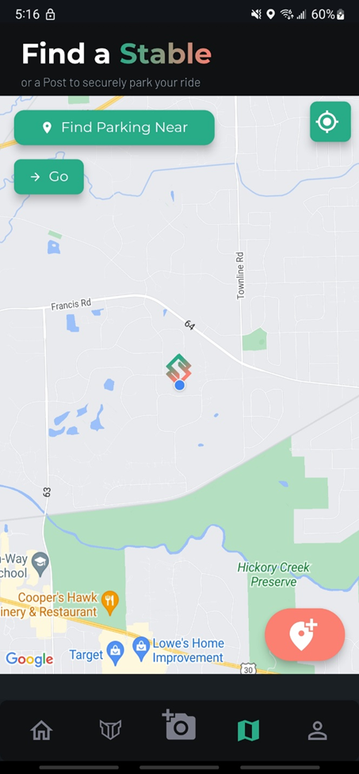
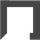
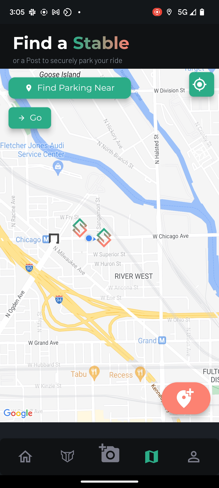
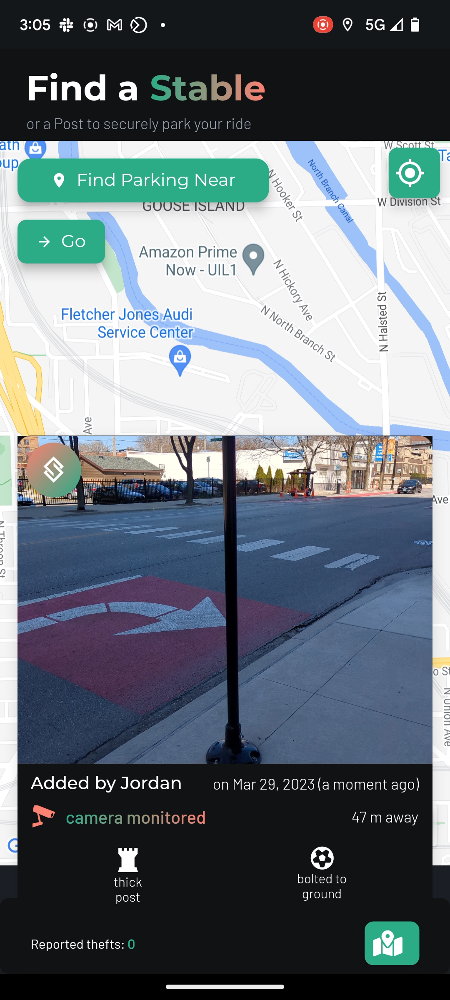

# Finding Stables

To look for [Posts](../definitions/post.md) and [Stables](../definitions/stable.md), begin by opening the  map view. Stables and Posts are denoted by icons on the map, which you can find by manually moving the map, or by entering in your destination into the place picker and pressing "Go".

!!!warning
The map view is a premium feature that is only available for [Stable+ Members](../stable+-membership/what-is-stable+.md). This is because we don't want members who don't contribute to the community to benefit from those that helped to populate the map of Posts and Stables. If you disagree with this decision, we welcome your feedback and invite you to make a new post on our [discussion board](https://stable.hellonext.co/b/general-feedback) or to discuss on our [Discord](https://discord.gg/sVQ8yfA8yB) server.
!!!

## How to Find Stables

Begin by navigating to the  map page. To search for a Stable in a specific location, type the location into the place picker (the "Find Parking Near" input field) at the top left as you would on Google Maps, and press Go. The map will automatically jump to the location you input and will show if there are any Stables in that area.

!!!danger
We are aware that the map view can be a bit buggy, including sometimes [going black](https://stable.hellonext.co/p/map-goes-black-when-clicking-on-the-find-parking-near-place-picker) and having [Stables occasionally disappear](https://stable.hellonext.co/p/stables-and-posts-sometimes-disappear-on-the-map-when-zooming-in-and-out) temporarily on the map. If you experience any issues with the map view, [please report new bugs here](https://stable.hellonext.co/b/bugs) or comment on existing posts to let us know--we'll try and fix them ASAP!
!!!

If there are Stables near the location you searched, they will appear on the map as . Posts are represented by the  icon.

### Viewing Stable Details

To view detailed information about a Stable, tap on the icon on the map. Doing so will bring up a bottom sheet that lets you view:

- photo(s) of the Stable, including a photo showing the security camera monitoring the spot if it is a Stable
- [attributes](../definitions/attributes.md) of the Stable, such as whether it's bolted to the ground, well lit, and other information
- when it was added
- how far away it is from your current location
- the display name of the user who added it (unless they have configured their account to remain anonymous under their [privacy settings](privacy-settings.md))
- whether there have any been any thefts reported at this location and, if so, when the last report was
- a button to open the precise location of this Stable in your system's default maps application, such as Google Maps or Apple Maps.

The goal of showing you this information is to equip you with the info you need to decide if this parking spot is safe enough for you. If you have any suggestions of other information that you think would be helpful in evaluating whether a parking spot is safe, feel free to [suggest it as a new feature](https://stable.hellonext.co/b/feature-requests).

!!! Tap photos to expand
You can tap on most photos within the app to view them in zoomable, full-resolution. Try it on the image of a Stable in the details bottom sheet that pops up!
!!!

## Reporting Incorrect or Missing Info

If you believe that a Stable or Post's information is inaccurate, please write to us at corrections@stablemobility.io and explain what you want to see corrected. We are working on building out [a way to do this in-app](https://stable.hellonext.co/p/an-in-app-way-to-report-missing-or-inaccurate-attributes-about-a-stable-or-post) that we expect to launch in the near future!
