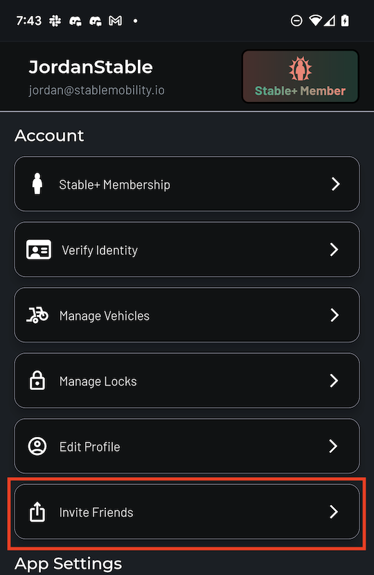
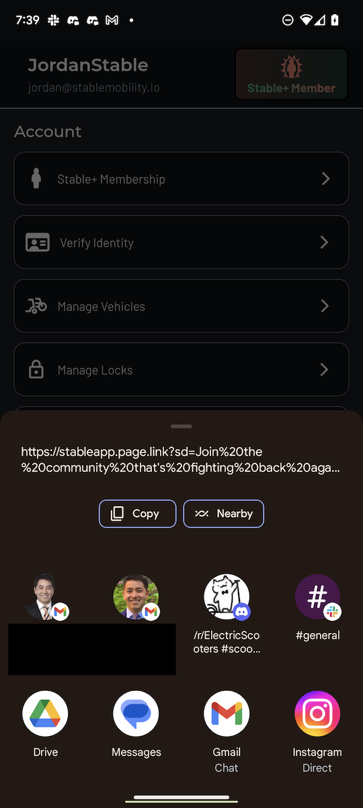
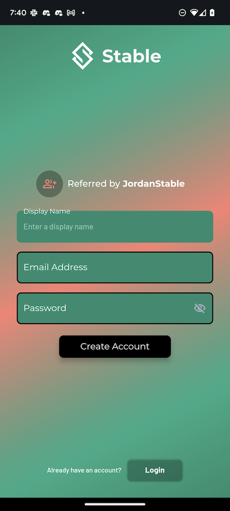

# Invite Friends

You can easily refer a friend using our new user referral system. Referred friends who register a new account will get **10 points and tokens**, while you earn ***30 points and tokens***! 

To refer a friend, go to your Accounts & Settings  tab, and tap on "Invite Friends".

Share the generated link with your friends however you like. 

If they use your referral link and download the app and launch the app, it should take them to the account registration page. If the referral link worked, they should a message saying that they were "Referred By" your display name.

You will receive a push notification when your friend signs up in the app. Thanks for spreading the word about Stable!!
