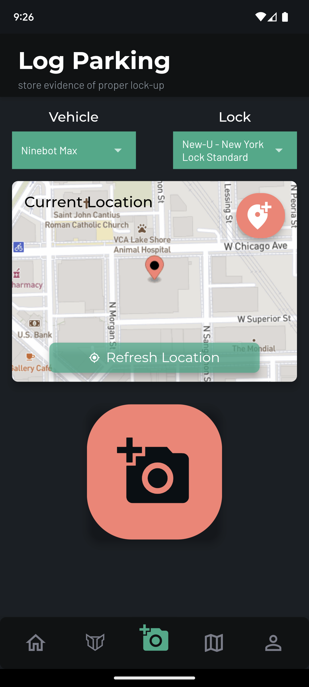
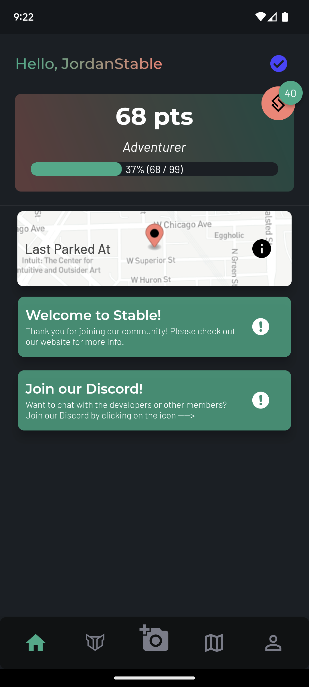
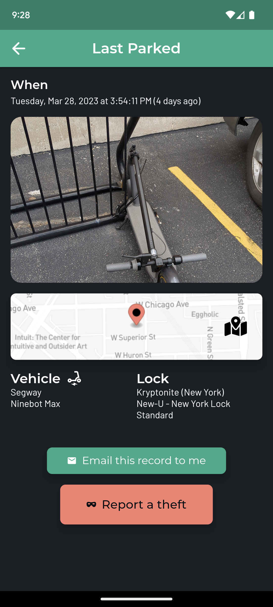

# Logging Parking

**Logging parking** refers to the process by which riders take a geotagged, timestamped photo of their locked-up vehicle demonstrated that their vehicle was properly locked up.

Most theft insurance and theft reimbursement policies require that your vehicle is "properly locked-up" as a precondition to pay out a claim when your vehicle is stolen. Proper lock-up typically requires some or all of the following:

- **An approved lock**: many policies require that you use an approved or allowed lock. Please check your policy to ensure you're using an approved lock.
- **Correct lock position**: some policies specify that the lock must be secured in one or more allowed positions or orientations. For instance, U-Locks should be secured around certain parts of the vehicle's frame (_i.e._, not only around a wheel).
- **Locked to an "immovable" object**: most policies require that your vehicle is locked up to an object that itself cannot easily be cut or moved. These are often referred to a "immovable" objects, although many times the object is _technically_ movable but very difficult to move (such as a large free-standing bike rack). Please refer to your policy for the specific definition.

Photo evidence of proper lock-up, along with proof of when and where that lock-up occurred, is the best way to prove that you complied your policy's terms and conditions. The Stable App makes it easy to snap a quick picture of your locked-up vehicle, which stores a verifiable record that you can obtain in the event of a theft.

!!!info Preserving Your Privacy
The app will **NEVER** show when a user parks at a particular location to other users; your parking records are private and only accessible by you.
!!!

## How to Log Parking

Begin by navigating to the  log parking page.

!!!warning
You must have at least one vehicle and one lock added before you can log parking. Please refer to [Account Setup](account-setup.md) for more info.
!!!

Your phone will prompt you to give the app permission to access your location. You need to grant it permission for the log parking feature to work, as the app will log the location you park in as evidence if your vehicle is stolen.

!!!
You'll notice that there is a button on the static map view that says "Refresh Location." If you open this page and then move before taking the photo, please tap this button to make sure you have an accurate fix on your current location. We designed the app this way in order to ***protect your privacy***; we do **not** continuously obtain your location, but instead only get your location when logging parking or when you map a new Stable.
!!!

If you have a vehicle and lock registered, the app will automatically select your favorited vehicle and favorited lock when you open the log parking page. If you have more than one vehicle or lock registered, and you are currently using a different vehicle or different lock than you designated as favorites, then please select your current vehicle and lock in the drop down menus.

!!!
**Tip**: You can adjust your favorite vehicle and lock any time by going to the profile page and selecting "Manage Vehicles" or "Manage Locks" to select your favorite. Simply press the heart button to select a favorite.
!!!

Your location will automatically be shown to you on a map, but if it doesn't show you the right location, you can refresh it by pressing the green Refresh Location button.

To create a new parking log record, please do the following:

1. Press the big SALMON colored camera button in the middle of the screen to access the camera to take a picture of your parked vehicle when you've locked it up
2. Take a picture of your vehicle, making sure to include in the frame exactly how it's parked and how the lock is secured to your vehicle and to an affixed, immovable object, such as a bike rack. When you take a picture, the app will ask you if you'd like to confirm or retake the picture.
3. If you think the image is clear and includes all relevant information, press confirm. The app will automatically take you to the home screen, with your parking logged. That's it! Easy.

## Last Parked

When you've logged parking, you can easily access the details about the spot you parked in from the Home Screen. Simply click on the tab that shows a map and says "Last Parked At".

You can view the image you took of your locked up vehicle and all of the details that were stored in the app. You can easily email the record to yourself by simply pressing the green "Email this record to me" button, which will send you all of this information to the email you registered your account with.

If your vehicle is stolen, you can report a theft by pressing the big salmon colored button that says "Report a theft". Stable will update that spot to show that a theft occurred to warn other users.
