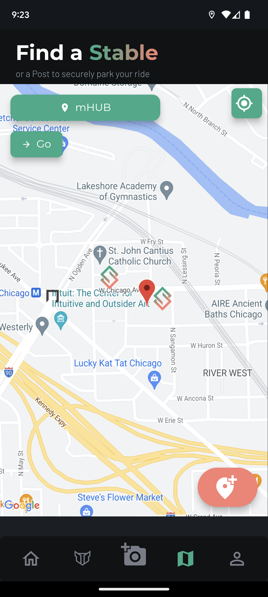

# Mapping Stables

**Mapping Stables** refers to the process by which riders can add new parking spots to the map for others to find.

You can map a Stable from two different screens:

1. From the **Log Parking**  screen
2. From the **Find a Stable**  map screen

To start mapping a stable, press the  button.

||| Log Parking

||| Find a Stable

|||

!!!warning
Users that are not [Stable+](../stable+-membership/what-is-stable+.md) will not be able to view the map screen, and therefore will not be able to map a stable from that screen. For this reason, users with a basic account can map stables from the Log Parking screen.
!!!

## How to Map a Stable

### 1. Nearby Stables

When you press the  button, the app will automatically check to see if there are any previously-mapped Stables nearby. If there are, you will see a tile for one or more Stables that are near the location you're in. Please check to see if any of them are the same as the Stable you're trying to map. If they are, you may be duplicating the work of others. If not, press continue.

!!!danger Duplicate Stables
If you map a Stable that someone else has already mapped—either by accident, or on purpose—we reserve the right to remove that Stable and revoke the points and tokens you were rewarded for mapping that Stable. Accounts that appear to intentionally duplicate stables repeatedly to "game the system" may be suspended or banned, causing the user to permanently surrender their points and tokens. We will contact the offending user prior to taking such action.
!!!

### 2. Photo

Next, take a clear photo of the bike rack or other immovable object. This photo will be displayed to other users that look up this Stable. The app will ask if you would like to retake the photo or to continue if you think the image is clear.

!!!danger Privacy notice
If you decide to map a Stable after you've parked your vehicle there, your vehicle **will** appear in the picture of the Stable, which will be visible to others that view the info about that Stable! Please consider whether you are comfortable with your vehicle being in the photo before mapping the Stable. If you would like for us to replace a photo of a Stable you've mapped, please contact us at corrections@stablemobility.io
!!!

### 3. Security Camera

Is this spot in view of a security camera? If so, then this spot may help you and others get footage of a theft in the future, making it more likely to get paid out from insurance or other theft reimbursement policies. 
 
If you don't select that the spot is camera monitored, this will be logged as a [Post](../definitions/post.md) and not a Stable. If you select that it *is* camera monitored, the app will ask you to take a second picture with the camera clearly in view. You must take the second picture to get points for a Stable, otherwise, the spot will be logged as a Post.

||| Security Camera

||| Photo

|||

!!! Is the spot really in view of the camera?
We are aware that, just because there is a security camera nearby, doesn't necessarily mean that it's operational, pointed at the parking spot, and that the owner is willing to share the footage. We are actively developing the process of verifying these details. Even if these details aren't confirmed, a spot that is *potentially* in view of a camera is better than one that is definitely **not** camera-monitored.
!!!

### 4. Other Details

As the final step, we ask that you identify any other relevant [attributes](../definitions/attributes.md) about this Stable. Currently, the following attributes are supported:

- **Covered**: protected from rain/precipitation
- **Bike Rack**: is this a bike rack (designed specifically for small vehicle parking)?
- **Thick**: if it's too thick for a typical U-Lock, then it's considered thick (i.e., only useful for cable or chain locks).
- **Well Lit**: At night, is this spot under or near a light?
- **Bolted to the Ground**: Is the object cemented or bolted to the ground, or free-standing/movable?

These details will help users filter for the Stables or Posts that they're looking for, so the more information you provide, the better the app will get over time!

Once you've selected the applicable attribute(s) (or selected "None of the Above" if none of them apply), your new Post or Stable will be added to the map and you'll be awarded your tokens!

### 5. Points & Tokens Reward

You're done! Enjoy the feeling of having contributed to the community with some confetti, [tokens, and points](points-and-tokens.md)!

If this spot was a Stable, you'll be awarded **5** tokens and points.

If this spot was a Post, you'll be awarded **1** token and point.

!!! Why are Stables worth more points than Posts?
We want to incentivize people to specifically add Stables, which improve a rider's chance at obtaining security camera footage in the event of a theft. Posts are less useful for theft and insurance purposes.
!!!
