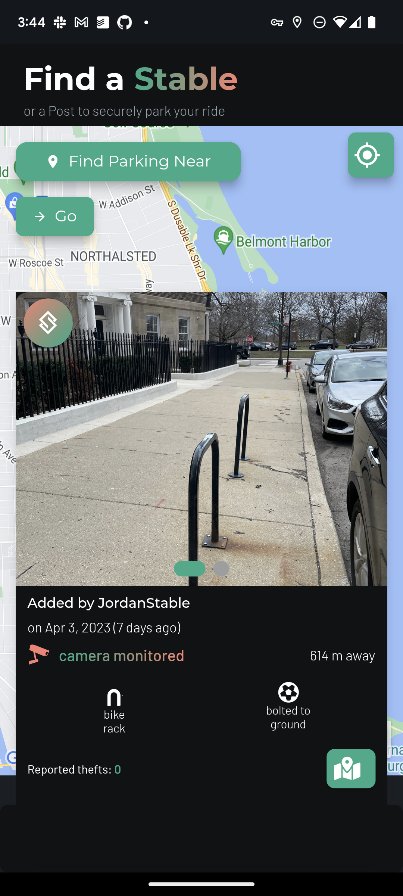
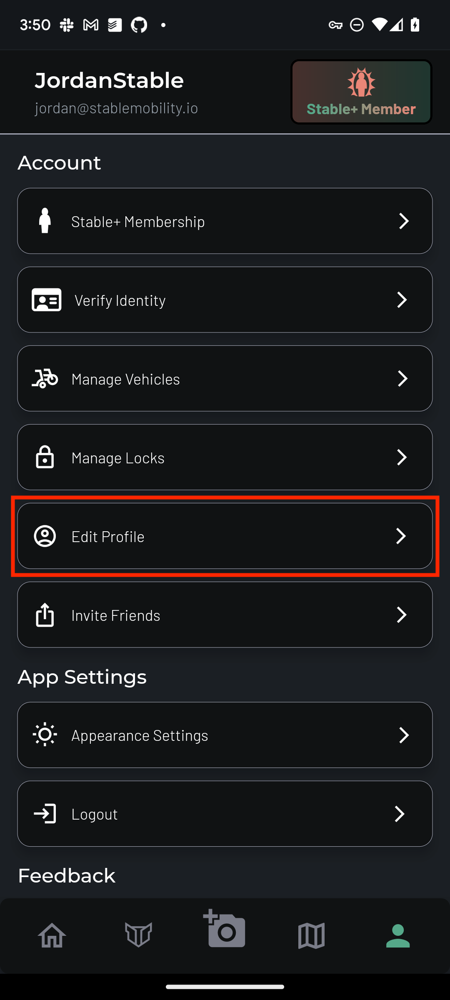
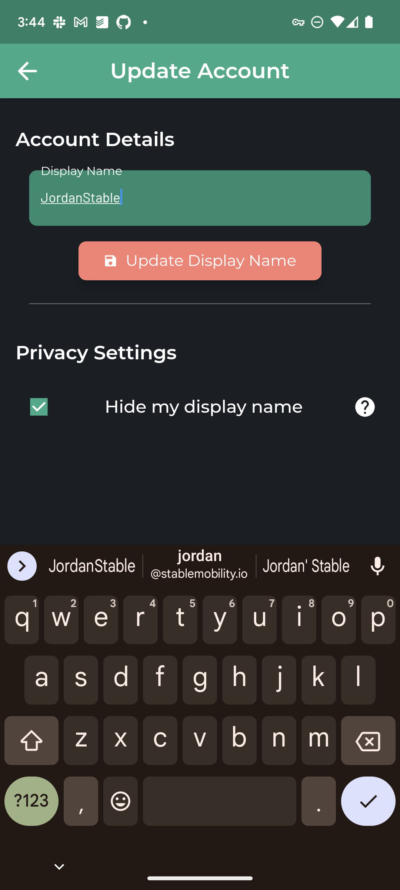

# Privacy Settings

## Display Name

Your **display name** is the only information about your account that can be visible to other users. By default, when you map a Stable, the Stable details page says that your display name mapped the Stable. This is done to recognize you for your community contributions.

### Hiding your display name

If you would like for your display name to be made anonymous, navigate to the Account & Settings  tab, and tap on "Edit Profile".

Then, check the box next to the line that says "Hide my display name".

!!!warning
When the box is **checked**, your display name is **hidden** to others. Conversely, when the box is ***unchecked***, your display name is ***visible*** to others.
!!!

When you check or uncheck the box, the setting is automatically saved. Now, when you return to the map view, you'll see that your display name is replaced by the word "anonymous".

You can change this setting at any time.

### Changing your display name

If you'd like to change your display name, simply return to the "Edit Profile" page, enter in the display name you'd like to use, and tap the salmon-colored "Update Display Name" button.

!!!
We do not currently check to see if your display name is unique. Thus, it is less of a username, and more of an alias.
!!!

