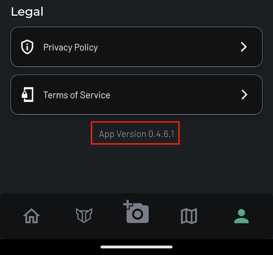

# Changelog

This page summarizes updates, changes, and improvements we make to the app for each release.

You can check your app's version number at the bottom of the Accounts and Settings  page.

## Open Beta

### v0.4.6.1

This update comes with some quick fixes and improvements based on initial feedback from early adopters. Thank you so much for being a part of the open beta testing!

#### New Features :new:
- [x] Added a [**user referral system**](../overview/invite-friends.md). Under your Accounts & Settings tab, click on "Invite Friends" to generate a unique invite code to share with your friends. Anyone who joins the app with your referral link will get **10 points and tokens** awarded after registering a new account, while you earn ***30 points and tokens***! Try it out and let us know if you have any issues with the referral system.
- [x] Added a [**giveaway tracker**](../open-beta/giveaways.md), which makes it easy to track your progress mapping Stables each month right from your Home Page. Check out the docs page and [https://www.stablemobility.io/giveaway](https://www.stablemobility.io/giveaway) for more details

#### Changes :gear:
- [x] Removed the Home Page icon indicating user account verification status, along with the Home Page notification falsely stating that some features are restricted until you complete account verification.

!!!
After discussing the question of whether we should verify user accounts, we have decided to make this feature **100% optional**. Originally, we saw account verification as an important step to prevent malicious activity on the platform—specifically, to deter potential thieves from using the platform to try and guess where users might be parking their PEVs. After some thought and many discussions, we think this risk is fairly low, given that thieves would be finding *camera-monitored* parking spots which put them at greater risk of being identified and arrested for larceny. We therefore have decided to make account verification optional. If you disagree with this decision, please feel free to share your thoughts with us on Discord, the feedback boards, or at feedback@stablemobility.io
!!!

- [x] Extended the Stable+ Trial Membership from 7 days to 31 days. If you join the app during the open beta testing, we will manually extend your Stable+ Trial membership through the end of July 2023.
- [x] Previously, when mapping a Stable, it was possible to take a photo of the camera monitoring that Stable and then proceed to the next page before the image finished uploading, which sometimes caused the Stable to be mapped without the second image and prevented the user from earning full points for mapping the Stable. This is no longer possible.

#### Bug Fixes :hammer_and_wrench:
- [x] Fixed an issue where pressing the "Go" button on the map view without entering anything into the "Find Stables Near" place picker would move the map to the middle of the Pacific Ocean. Now it should do nothing until you've first entered a place into the place picker.

### v0.4.5.1

Open beta launch version.
